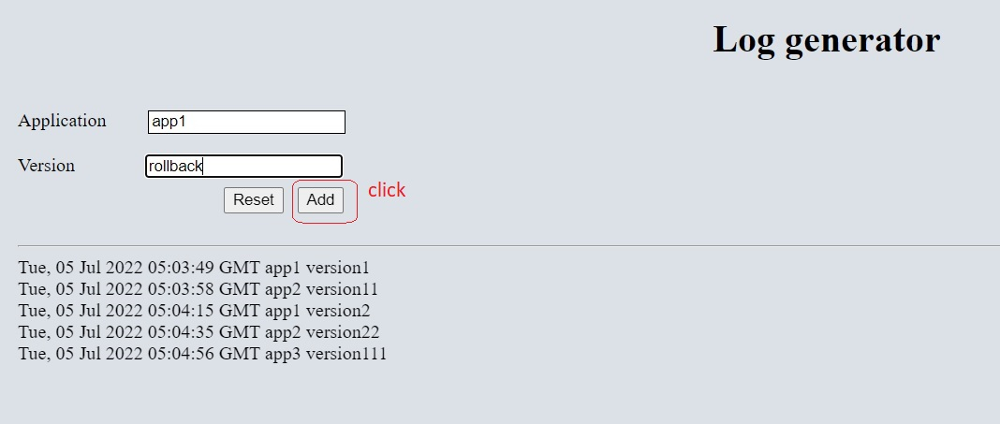
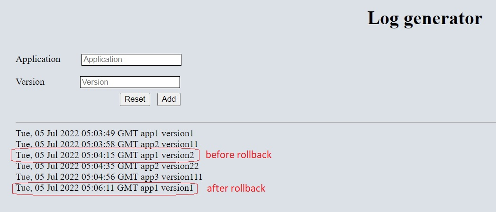

<h1 align="center">Log Generator</h1>

<section>
  <h2>Summary</h2>
  
Simple UI of a log generator for application version updates. When users upload new versions or roll them back, a new record appears with a timestamp of the moment when a new record was added.

</section>

<section>
  <h2>How to use</h2>
  <ul>
  <li>Add app name and its version, e.g. "app1", "version1". The fields accept alphanumeric characters, underscores, and dashes</li>
  <li>Click "Add" button</li>
  <li>Field input will be validated, and if it's correct, a new record will be added below. E.g. "Tue, 05 Jul 2022 04:18:34 GMT app1 version1". If the input is not correct, an appropriate message will be provided</li>
  
  <li>If a version of the app was rolled back, instead of the version insert "rollback" into the "Version" field. With this the previous version of the app will be shown below</li>
  
  <li>This app keeps track of all versions of each application</li>
  <li>Button "Reset" can be clicked any time to clean both input fields</li>
  </ul>
</section>

<section>
  <h2>TBD</h2>
  

  <ul>
  <li>Add database</li>
  <li>Improve UI</li>
  </ul>
  

</section>
